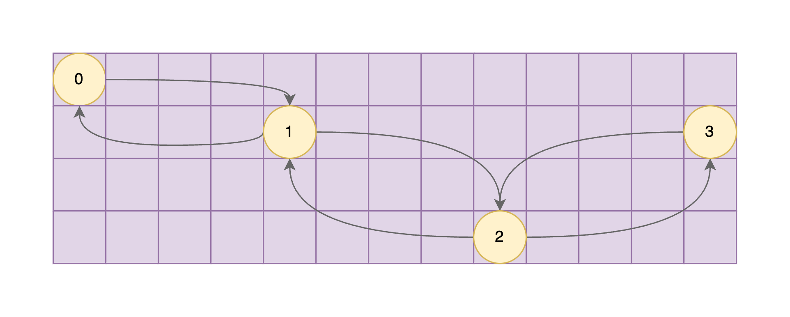
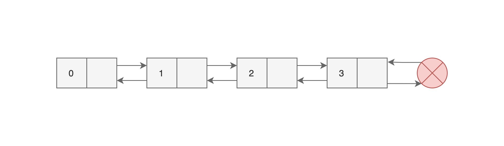

<h1 align="center">
  <b>Linked Lists</b>
</h1>

A linked list is a linear data structure whose order is not inherent to their physical placement in memory. Instead, each element in the linked list contains the value it is representing and a property that points to the their neighbouring element in the linked list. Essentially, each element is *linked* to each other and this relationship is what gives order to a linked list.

Every element in a linked list is conventionally called a *node*. Each node has a property that contains the value that a particular node represents. It can be a simple data types like a string, or a number. It can also be another object.

Each node also contains a property, conventionally called a *reference field*, that contains a *reference* to the location in memory of a node from the same linked list.

Unlike arrays or dictionaries, we cannot access a value in a linked list through an index because linked lists do not have indexes. In order to access a specific value in a linked list, we need to traverse from the head of a linked list until we reach the node that we are looking for.

<figure align="center">
  
  <figcaption>
    <b>Figure 1.1</b> 
    
      A visual simplication of a <a href="../python/singly-linked-list.py">singly linked list</a> in memory.
    
  </figcaption>
</figure>

 
 

There are two types of linked list: singly linked list, and a doubly linked list. The image above is that of a singly linked list stored in memory.   The image below is a visual simplification of a doubly linked list stored in memory.

<figure align="center">
  
  <figcaption>
    <b>Figure 1.2</b> 
    
      A visual representation of a <a href="../python/doubly-linked-list.py">doubly linked list</a> in memory.
    
  </figcaption>
</figure>

## **Singly Linked List**

A singly linked is composed of nodes that appear to be contiguous but are actually scattered in memory. Each node is linked to the next node in the linked list via a reference field. This reference field is a description of the next node's location in memory. Through this, the singly-linked list is organized in sequential manner.

One distinctive characteristic of a singly linked list from a doubly linked list is that it is unidirectional. Meaning, the nodes can only be accessed in one direction starting from the head node.

<figure align="center">
  
  <figcaption>
    <b>Figure 1.3</b> 
    
      A visual simplification of a <a href="../python/singly-linked-list.py">singly linked list</a>.
    
  </figcaption>
</figure>

## **Doubly Linked List**

A doubly linked is similar to a singly linked list in almost all aspects. The only difference is that a doubly linked list is bidirectional in the sense that it can be traversed forwards and backwards. This implies that every node in a doubly linked list contains a reference to the location in memory of the nodes before and after it.

<figure align="center">
  
  <figcaption>
    <b>Figure 1.4</b> 
    
      A visual simplification of a <a href="../python/doubly-linked-list.py">singly linked list</a>.
    
  </figcaption>
</figure>